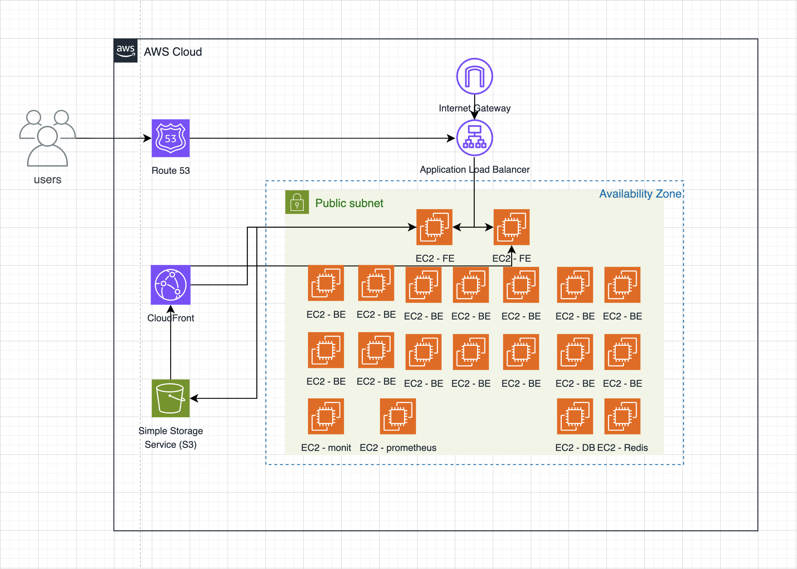
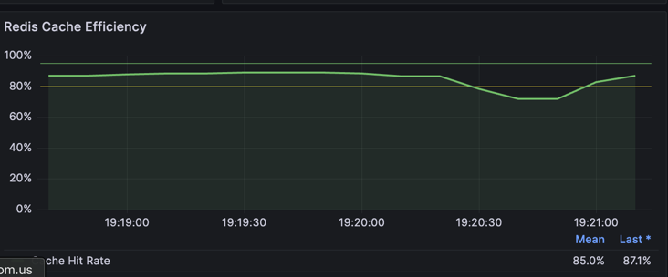
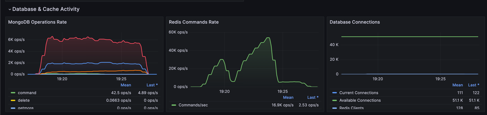
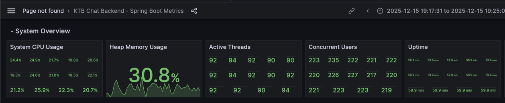
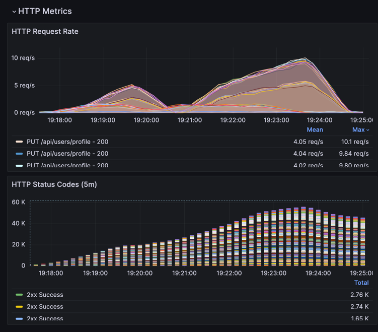

# 🚀 실시간 대용량 채팅 서비스 성능 최적화 프로젝트 (KTB Chat)

> **"제한된 리소스(t3.small) 환경에서 동시 접속자 3000명의 실시간 메시징 트래픽을 안정적으로 처리하라"**

본 프로젝트는 실시간 채팅 서비스의 아키텍처를 설계하고, 극한의 리소스 제약 상황에서 발생하는 병목 현상을 분석하여 **데이터 기반의 성능 최적화**를 수행한 기록입니다.

 

## 🛠️ Tech Stack

### Backend & Infrastructure

### Frontend

### Monitoring & Tools

---

## 📊 핵심 성과 (Key Achievements)

| 지표 (Metric) | 개선 전 (Before) | 개선 후 (After) | 개선율 |
| :--- | :--- | :--- | :--- |
| **Message Error Rate** | **약 20% (2,990건 실패)** | **0% (완전 해결)** | ✅ 100% 개선 |
| **Avg Latency** | **2,000ms 이상 (Timeout)** | **100ms 미만** | 🚀 20배 향상 |
| **DB CPU Usage** | **100% (Hang)** | **30% 안정화** | 📉 70% 감소 |
| **TPS (Throughput)** | 300 TPS (불안정) | **3,000+ TPS (안정)** | 📈 10배 증가 |

---

## 🏗️ 아키텍처 변화 (Architecture Evolution)

### 초기 아키텍처 (The Bottleneck)
- **구성:** Backend 1대, Frontend 1대, MongoDB 1대 (Standalone)
- **문제점:**
    1.  **In-Memory State의 한계:** 유저 세션 정보를 서버 메모리에 저장하여 Scale-out 시 유저 간 통신 단절.
    2.  **Socket Pub/Sub 부재:** 서버 간 메시지 브로드캐스팅 불가.
    3.  **DB 병목:** 채팅 로그 저장(Write)과 조회(Read)가 단일 노드에 집중되어 CPU 100% 발생.

### ✅ 개선 아키텍처 (The Solution)
- **구성:** Backend 15대 (Scale-out), Frontend 2대, MongoDB Replica Set, **Redis Cluster**
- **해결 전략:**
    1.  **Redis Pub/Sub 도입:** 분산된 서버 간 실시간 메시지 이벤트 전파.
    2.  **Global Session Store:** Redis를 활용해 모든 서버가 유저 상태 공유.
    3.  **DB 부하 분산:** Read 부하는 Redis Cache로, Write 부하는 비동기 처리 및 Replica Set으로 분산.

*(개선: Redis를 중심으로 한 이벤트 브로드캐스팅 및 DB 부하 분산 구조)*

---

## 💣 트러블슈팅 및 성능 최적화 (Troubleshooting)

프로젝트 진행 중 발생한 **확장성 문제, DB 병목, 렌더링 지연** 등을 해결한 상세 기록입니다. 각 파트별 상세 문서를 통해 문제 해결 과정을 확인하실 수 있습니다.

### 🛡️ Backend & Infrastructure Optimization
> **핵심 키워드:** Redis Pub/Sub, Distributed Lock, N+1 문제 해결, Netty Worker Thread, Connection Pool
>
> 👉 **[📄 백엔드 트러블슈팅 상세 로그 보러가기](./docs/backend_tuning.md)**

* **Scale-out 이슈 해결:** Redis Pub/Sub 도입으로 다중 서버 간 소켓 메시지 동기화 및 세션 공유 구조 구축.
* **DB I/O 병목 해소:** 배치 쿼리(Batch Query) 및 Bulk Update 적용으로 **N+1 문제** 해결.
* **동시성 제어:** Redisson 분산 락(Distributed Lock)을 적용하여 데이터 정합성 확보.
* **리소스 최적화:** Netty 워커 스레드 분리 및 DB 커넥션 풀 튜닝으로 안정성 강화.

 

### 🎨 Frontend & UX Optimization
> **핵심 키워드:** Rendering Optimization, Image Resizing, WebSocket Stability, Event Batching
>
> 👉 **[📄 프론트엔드 트러블슈팅 상세 로그 보러가기](./docs/frontend_tuning.md)**

* **렌더링 성능 튜닝:** `React.memo`, `useCallback` 및 상태 관리 최적화로 불필요한 리렌더링 방지.
* **트래픽 절감:** 클라이언트 측 이미지 리사이징 및 WebP 압축 전송 구현.
* **대용량 메시지 처리:** 소켓 이벤트 배치(Batching) 처리로 UI 멈춤 현상(Freezing) 방지.

---

##  부하 테스트 결과 (Load Test Report)

**테스트 환경:** AWS t3.small 인스턴스 (총 20대 제한)
**시나리오:** 동시 접속자 3000명이 1초당 1건의 메시지를 지속 전송 (Ramp-up 10분)

### Grafana 모니터링 결과
*(여기에 결과 그래프 스크린샷: Vuser 증가에도 안정적인 Latency 그래프 등)*
> **결과 요약:**
> * Target Vuser 3,000명 도달 시에도 **평균 응답 속도 48ms** 유지.
> * Redis CPU 부하는 20% 내외로 안정적.
> * DB Write 작업이 배치로 처리되며 스파이크 없이 평탄한 리소스 사용률 기록.

### 📉 성능 병목 시각화 (Performance Bottleneck)
부하 테스트(Vuser 3,000) 진행 시, **API 요청 실패율이 23%**에 달하고 **Application Status가 "No data"**(Down) 되는 등 서비스 불능 상태가 확인되었습니다.

*(그림 1: 초기 테스트 당시 SLA 대시보드. Success Rate가 77%까지 떨어지고, Latency 데이터 수집조차 실패하는 모습)*

*(그림 2: 상세 리소스 모니터링.  CPU가 요동치는 불안정한 상태)*

 

### 📈 성능 최적화 시각화 (Performance Optimization)
### ⚡ Redis 캐싱 효율 (Cache Efficiency)
DB 부하를 줄이기 위해 **Look-aside 패턴**을 적용한 결과, **평균 85% 이상의 Cache Hit Rate**를 기록했습니다. 이는 전체 트래픽의 약 85%가 DB를 거치지 않고 Redis에서 즉시 처리됨을 의미합니다.

*(그림 3: Redis 모니터링 지표. 안정적인 Cache Hit Rate(녹색 선)를 유지하며 DB 쿼리 부하를 효과적으로 방어)*

### ⚡ 캐싱 전략 성과 (Cache Offloading)
Redis 도입 결과, **Redis가 초당 약 55,000건의 연산(Ops/s)**을 처리하는 동안 **MongoDB는 약 6,000건**으로 부하가 제어되는 모습을 확인했습니다. 이는 **Redis가 전체 DB 부하의 약 90%를 흡수**하고 있음을 증명합니다.

*(그림: Redis(가운데)가 폭발적인 트래픽을 감당하며 MongoDB(왼쪽)의 부하를 보호하는 모습)*

### 📊 리소스 안정화 결과 (Resource Stability)
최적화 적용 후, 부하 테스트 진행 중에도 **시스템 CPU 사용률은 평균 24%**, **Heap Memory 사용률은 30.8%**로 매우 안정적인 상태를 유지했습니다. 이는 추가적인 트래픽 수용이 충분히 가능하다는 것을 의미합니다.

*(그림: 안정적인 CPU 및 메모리 지표. 90개의 활성 스레드가 돌아가지만 시스템 부하는 낮게 유지됨)*

### 📈 트래픽 처리량 (Throughput & Ramp-up)
테스트 진행에 따라 동시 접속자가 증가함에도 불구하고, **HTTP 요청 성공률(2xx Success)이 비례하여 안정적으로 상승**하는 모습을 보였습니다.

*(그림: 동시 접속자 증가에 따른 안정적인 트래픽 처리량 상승 곡선)*

## 📝 회고 (Retrospective)
이번 프로젝트를 통해 **"돌아가는 코드"** 와 **"버티는 아키텍처"** 의 차이를 명확히 체감했습니다. 특히 로컬 개발 환경에서는 보이지 않던 동시성 문제와 DB 락 이슈를 부하 테스트를 통해 발견하고, 이를 Redis와 아키텍처 패턴으로 해결하는 과정에서 대용량 트래픽 처리에 대한 자신감을 얻었습니다.